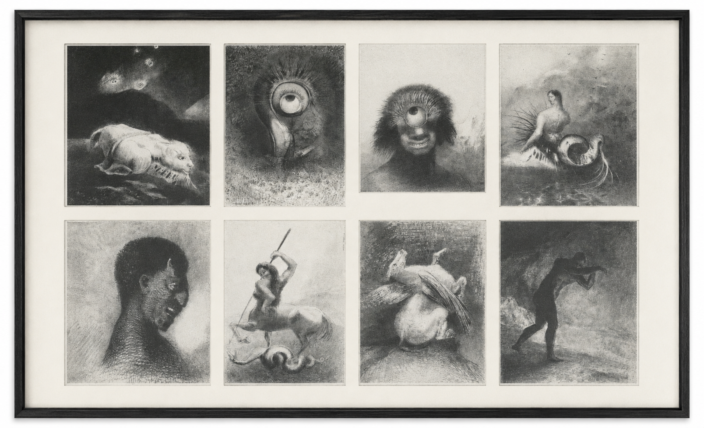
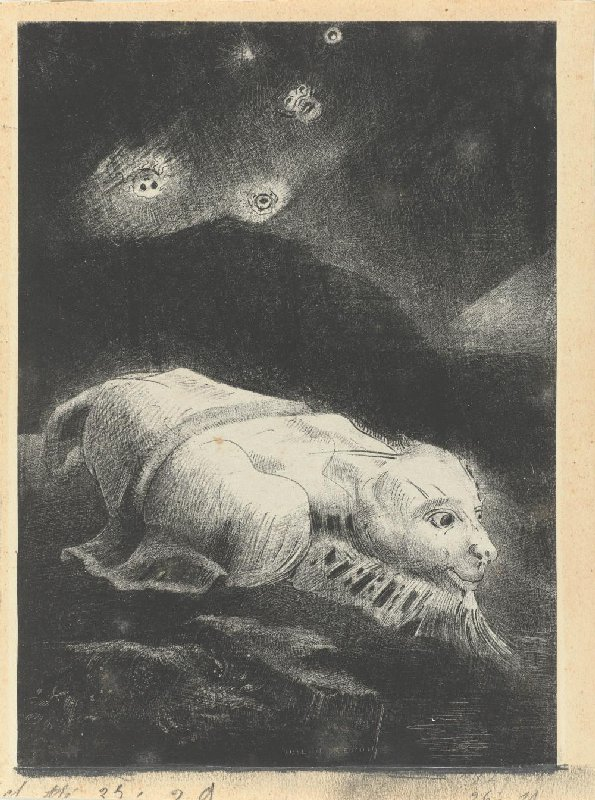
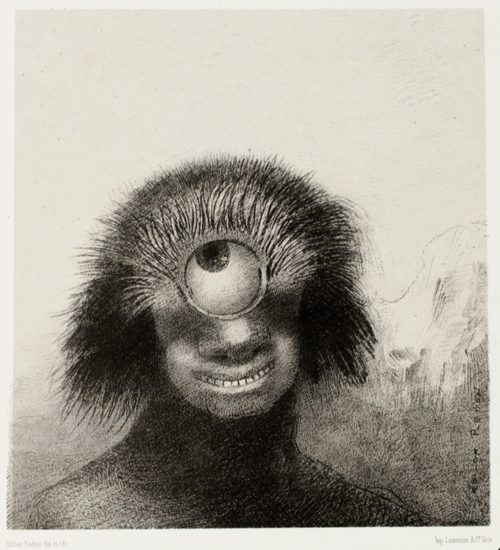

Ce n'est pas souvent considéré, mais un des points critiques de la théorie darwinienne est l'insubstantialité morale. Pour l'éthos chrétien, du moins d'après l'interprétation traditionnelle, le bien et le mal sont des substances actives. (La doctrine de la *privatio boni*, indépendamment de ce que nous pensons, est artificielle et tardive.) Mais, d'un point de vue métaphysique, le monde darwinien est un monde insubstantiel, et notre manière de considérer certaines choses comme bonnes ou mauvaises est un phénomène biologique que la neuroscience moderne réduit, correctement à mon avis, au cerveau.

Je ne veux pas discuter de ces choses; je voudrais plutôt montrer comment Redon a exprimé ces problèmes dans son œuvre. La raison est triple.

Premièrement, Redon étudia la théorie de l'évolution avec un certain degré de détail. C'était un ami d'Armand Clavaud, un botaniste qui l'initia aux lectures de Darwin et Lamarck, mais aussi à celles de Baudelaire, Poe, et certains poètes hindous. Redon se fascina pour ce que l'on pourrait appeler le problème de l'origine, et produisit un album magnifique nommé précisément *Les Origines*. En 1881, il vit à Paris une exposition des aborigènes captifs de la Terre de Feu et dit:

> They provided me with a dream of primitive life, nostalgia for the pure and simple existence of our beginnings. I have never felt with as much force the gap our own nature spans between the crawling beast and our higher destiny. . . .What a poem, this quite perfect organism, emerging from the primeval slime to stand beside us and stammer out the first stanzas of a universal hymn.

    
  <figcaption>Les Origines</figcaption>

Cette citation révèle sa fascination, bien que mélangée aux préjugés propres de son temps, pour la «vase primitive» et l'histoire évolutive de l'homme.

Deuxièmement, Redon comprenait les problèmes posés par la théorie de l'évolution de manière plus sophistiquée que ses contemporains. L'Européen moyen s'inquiétait du passage d'une forme à une autre, un problème réel mais mineur d'un point de vue scientifique et spirituel. La mesure dans laquelle l'Europe se préoccupait de cette question se révèle dans les nombreuses caricatures représentant des singes qui se transforment en hommes, satires qui au fil du temps se transformèrent en satires d'elles-mêmes. Mais Redon était fasciné par un problème plus fondamental et complexe; à savoir, le passage de l'informe à ce qui a une forme. C'est le problème du xάος hésiodique, que Darwin ressuscita et qui est plus difficile à résoudre et à caricaturer. Par exemple, dans *Les Origines* nous voyons l'œuvre *Quand s'éveillait la vie au fond de la matière obscure*, dans laquelle une créature est en train de surgir précisément d'une vase primitive, tandis que, sur le fond obscur et depuis l'espace, des têtes flottantes s'approchent de la Terre. D'après Sven Sandström, le premier expert à organiser *Les Origines*, la lecture de cette œuvre est temporelle: «When the seed from space arrives on earth life starts in early states to develop from matter."

    
  <figcaption>Quand s'éveillait la vie au fond de la matière obscure</figcaption>

Il y a un autre example dans l'œuvre *Le Polype difforme flottait sur les rivages, sorte de cyclope souriant et hideux*, aussi de *Les Origines*, dans laquelle nous voyons une «polype» (le mot fait référence à Polyphème). La créature n'est ni animal ni homme. Ses traits grotesques évoquent le primitif et ce qui n'a pas encore de forme, mais qui est en train de l'acquérir. Mais, comme une étude a indiqué [1], le «polype» est aussi 

> «... un organisme unicellulaire qui faisait l'objet de nombreuses investigations scientifiques à l'époque, non seulement en tant que l'une des premières formes de vie, mais aussi parce qu'il était étrangement inclassable. Ni tout à fait plante, ni tout à fait animal, il fut désigné par les naturalistes comme un emblème de l'informe et de l'indéterminisme»

    
  <figcaption>Le Polype difforme flottait sur les rivages, sorte de cyclope souriant et hideux</figcaption>

Finalement, malgré sa compréhension de la théorie de l'évolution et son désir d'imaginer le passage de l'informe à la complexité de la vie comme quelque chose de matériel, Redon pressentait une force spirituelle sous-jacente à la vie. Il a même dit, dans ses *Confidences d'Artiste*, qu'Armand Clavaud était un admirateur fervent de Spinoza, et il n'est pas difficile d'imaginer que Redon le lisait aussi. Il dessina un Christ, mais appela l'œuvre *Buda*, en suggérant que toutes les religions émanent d'une source commune. Bien qu'immergé dans le cercle symboliste ---il était habitué des réunions de Mallarmé---, son intérêt scientifique lui fit comprendre comme aucun autre les principes spinozistes qui sous-tendent la théorie du double aspect. Tandis que la plupart des symbolistes pressentaient dans la réalité sensible un secret esthétique soit merveilleux, soit décadent, Redon voyait un arcane spirituel qui non seulement ne contredisait pas la science, mais la sublimait.

    
  <figcaption>Buda</figcaption>

La vision de la science de Redon était *correcte* au sens usuel du terme: à savoir, elle est en accord avec mes jugements et préjugés. Blague à part, la vision spinoziste du monde est, il me semble, la seule possible face à tout ce que nous avons appris de la neuroscience. Comme c'est souvent le cas, l'art surpasse la science pour exprimer la nature des choses. La plupart des références à Redon en ligne le décrivent comme un fou, comme un homme qui coloria des visions étranges et inexplicables. Mais il ne fit rien de plus que se poser les bonnes questions face aux découvertes de son temps et les sublimer avec un art exquis.

[1]: https://www.researchgate.net/publication/345364261_Into_the_Primeval_Slime_Body_and_Self_in_Redon's_Evolutionary_Universe
