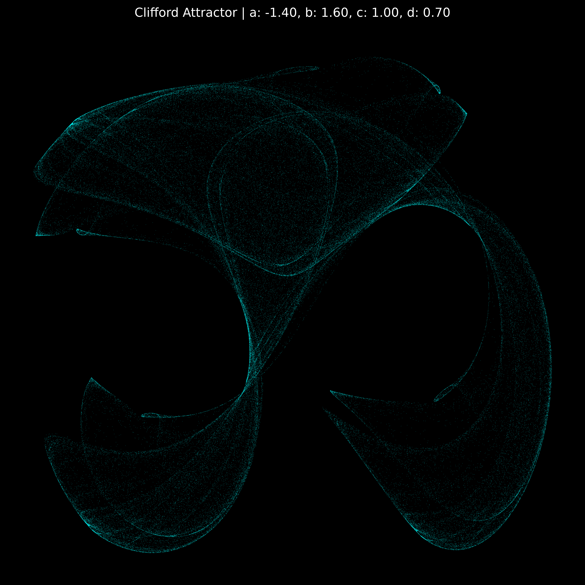
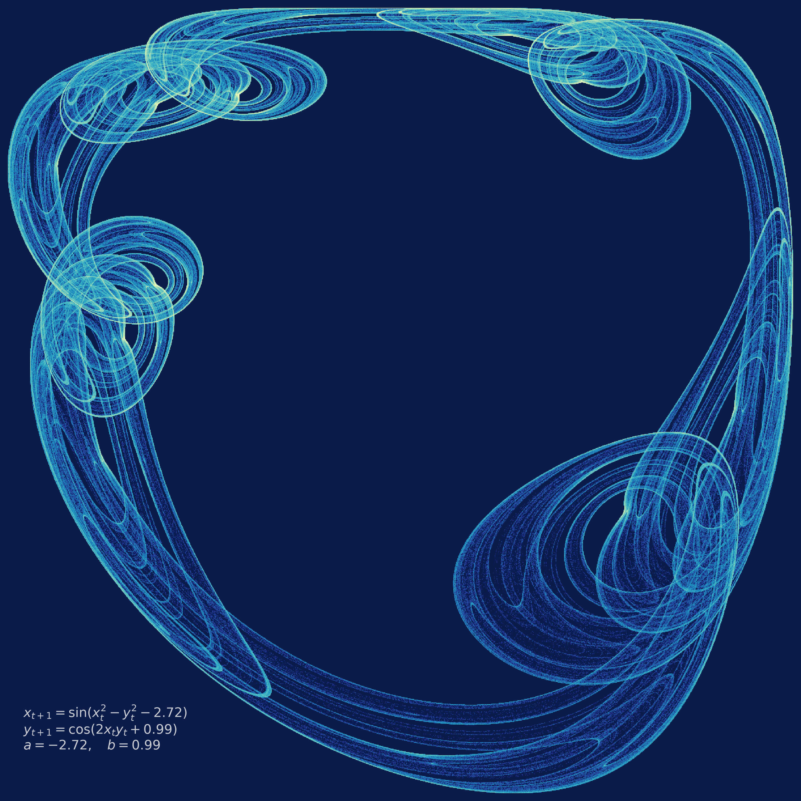
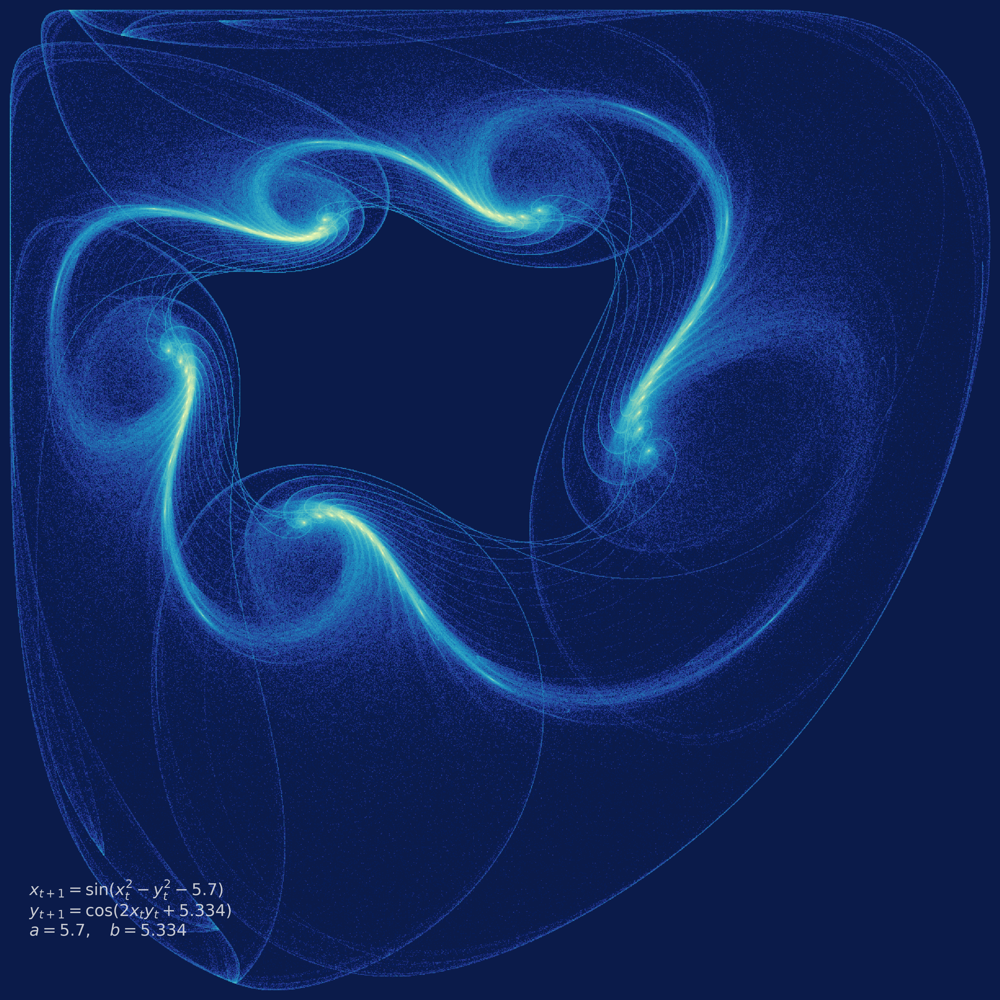
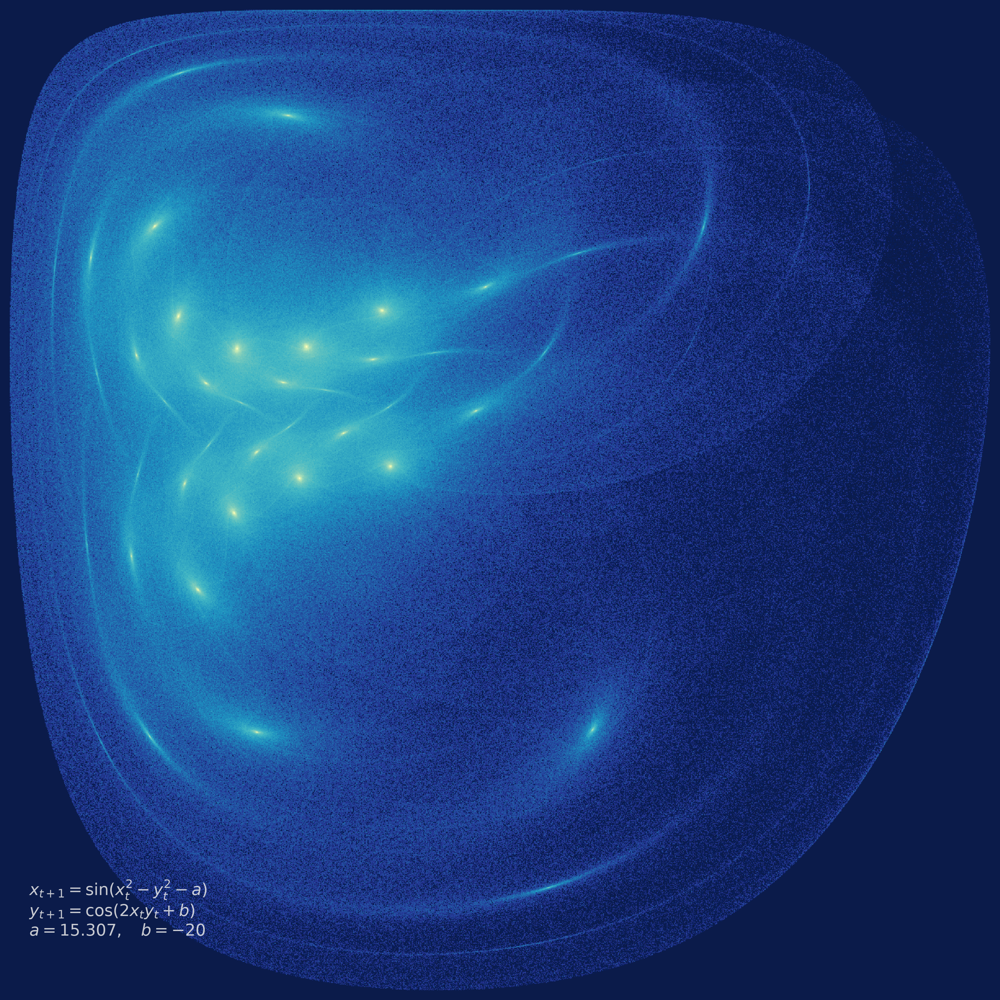
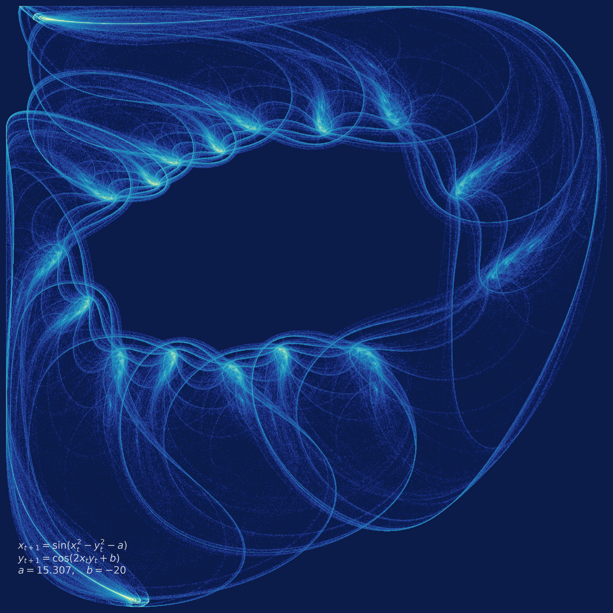
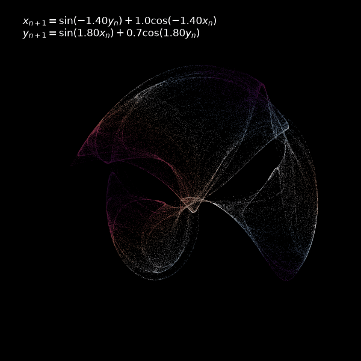

Las matemáticas y la programación son una forma de la poesía. La programación se
condice tanto con esta definición que incluso se escribe en verso, aunque esta
sea la evidencia más superficial. Lo cierto es que estas disciplinas satisfacen
ciertas propiedades que la poesía, o al menos la buena poesía, también: ser
doblemente susceptible a una apreciación abstracta y a una apreciación visual;
que, aunque cada unidad (variable, línea de código, verso) sirva a un único
sentido, ninguna juegue un papel semántico del todo unívoco; que el contenido o
la semántica sirva, por sobre todo, al propósito de revelar una forma o una
estructura, como expresó el propio Mallarmé en su poema *Salut*:

>Rien, cette écume, vierge vers<br>
>À ne désigner que la coupe

Esta enumeración no es exhaustiva, pero acaso baste para inspirar la idea de que
una matemática o una programación artística no solo son posibles, sino que las
expresiones "matemática artística" y "programación artística" son tautológicas. 

En este escrito, voy a mostrar algunos casos extremos en que es indudable que
las matemáticas y la programación producen patrones visuales dignos de ser
llamados arte. Y la historia comienza con un concepto que, hasta involucrarme
con la producción matemática de patrones artísticos, me era ajeno: el de
*atractor*. Matemáticamente hablando, dado un sistema dinámico $S$, un atractor
es el conjunto de estados a los cuales el sistema tiende a evolucionar incluso
partiendo desde condiciones iniciales muy diversas. La definición formal de un
atractor no es particularmente compleja, por ricas que sean las propiedades del
concepto. En general, si $f(t, \vec{x})$ describe un sistema que en el tiempo
$t$ está parametrizado en $\vec{x}$, un atractor es un subconjunto $A$ del
conjunto de estados posibles $S$ que satisface:

- Si $a \in A$, entonces $f(t, a) \in A$ para $t > 0$. En lenguaje humano, si el
sistema está en un estado atractor, seguirá estándolo en el futuro.
- Existe un entorno $B(A)$ de $A$ consistente de todos los puntos que conducen a
$A$ en el límite $t \to \infty$. En lenguaje humano, los estados cercanos pero
exteriores al atractor tienden a él en el tiempo.
- No existe ningún sub-espacio de $A$ (no vacío) que cumpla las dos propiedades
anteriores. Es decir, un atractor no tiene otros atractores dentro de él:
comprende *un* conjunto de estados de atracción y no más.

Existe un atractor en particular, descubierto y popularizado por [Clifford
Pickover](https://es.wikipedia.org/wiki/Clifford_Pickover), que tiene cierto
interés artístico. Se define como

$$
\begin{align}
    x_{n+1} &= \sin(a y_n) + c \cos(a x_n) \\\\
    y_{n+1} &= \sin(b x_n) + d \cos(b y_n)
\end{align}
$$

En rigor, estas ecuaciones no son un atractor, porque no son un conjunto de
estados. Más bien, son el sistema cuyo atractor es revelado cuando producimos
suficientes instancias de pares $(x, y)$. Implementar este sistema en Python es
sumamente simple, y podemos graficar los pares de puntos resultantes. Veremos
que los puntos generados no están dispersos aleatoriamente, sino que se agrupan
en un orden interesante. El conjunto de coordenadas en torno a las cuales los
puntos se agrupan conforman el atractor, y el patrón obtenido es hermoso. Por
ejemplo:

<p align="center">
    
</p>


<p align="center">
    
</p>

<p align="center">
    
</p>

<p align="center">
    
</p>

<p align="center">
    
</p>

Esta es la esencia de cómo los atractores nos permiten generar imágenes
hermosas: en un espacio bidimensional, la simulación de cualquier sistema
dinámico que posea atractores producirá patrones de interés. La riqueza visual
de los patrones producidos puede aumentarse si, por ejemplo, hacemos variar los
meta-parámetros del sistema (en este caso, $a, c, b$ y $d$) con el tiempo. La
forma más fácil de hacer esto es tomar un parámetro $\varphi$ arbitrario y
definirlo como $\varphi(t) = \alpha + \beta \sin(t)$, es decir hacer que el
parámetro fluctúe oscilatoriamente alrededor de un centro $\alpha$. El tiempo
$t$ puede hacerse avanzar de $0$ a $2\pi$ creando un bucle perfecto:

$$
t = (\text{frame}/k) \cdot 2\pi
$$

con $k$ la cantidad de frames en la animación. Para hacer la cosa todavía más
interesante, podemos hacer que el color de cada punto también varíe de manera
bonita, podemos asignar al punto $(x, y)$ en cada instante de tiempo el color

$$C_i = \sin(x_i \cdot a) + \cos(y_i \cdot b)$$

¿El resultado? Esta hermosura.

<p align="center">
    
</p>

--- 

Existe un segundo método, relativamente más complejo, para generar patrones
visualmente interesantes. Este método consiste en definir una matriz $A(t_1,
t_2) \in \mathbb{C}^{n \times n}$, donde $t_1, t_2$ son parámetros que definen
dos coeficientes variables de la misma. Si $t_1, t_2$ se muestrean de manera
uniforme en un intervalo $[a, b]$, de manera que $A(t_1, t_2)$ conforme una
matriz aleatoria, entonces para cada par $\vec{t}$ existe un vector propio
$\vec{v}$ y un valor propio $\lambda$ que satisfacen 

$$
A(t_1, t_2) \vec{v} = \lambda \vec{v}
$$

Cada autovalor $\lambda = x + iy$, por ser complejo, define un par de
coordenadas $(\text{Re}(\lambda), \text{Im}(\lambda))$ que pueden graficarse en
un plano bidimensional. El algoritmo de generación es simple: muestrear $N$
matrices $A(t_1, t_2)$, calcular sus autovalores y graficar el par de
coordenadas determinado por cada uno.

Analíticamente hablando, el polinomio característico de una matriz en un espacio
de dimensión $n \geq 5$ es frecuentemente imposible de resolver. Por eso el
cálculo de los autovalores se hace mediante métodos numéricos, como el método
QR, que `numpy` implementa.

```
**Input:**
- Matriz paramétrica $A(t_1, t_2)$
- Espacio de muestreo $[a, b]$
- Número de iteraciones $N$

**Output:**
- Plot en 2D de la densidad espectral (fancy para "de los autovalores") de
$A(t_1, t_2)$

P ← ∅

for k = 1 to N do
    Sample t₁ ~ U(a, b)
    Sample t₂ ~ U(a, b)

    Aₖ ← A(t₁, t₂)

    Λₖ ← eigvals(Aₖ) 

    for each λ ∈ Λₖ do
        x ← Re(λ)
        y ← Im(λ)
        P ← P ∪ {(x, y)}
    end for
end for

Plotear P en ℝ² con un scatter plot de opacidad baja (α ≪ 1).
```

Usando esta técnica podemos generar el patrón que a mí me gusta llamar *El
Eigenmensch*, juego tonto con el Übermensch de Nietzsche. Esta figura fue
producida por Simone Conradi, sin dudas el mayor talento artístico de las
matemáticas, y yo no hice más que reproducirla en mi propia computadora.

<p align="center">
    
</p>

Esta figura surge si se toma la matriz 

$$
A(t_1, t_2) := \begin{pmatrix}
0      & -10i & -10i & t_1 & t_2 \\\\
10i    & 0    & 10i  & 0   & 10i \\\\
-0.1   & 10i  & 10i  & 0   & 0 \\\\
-10i   & 10i  & 0    & 10i & -10i \\\\
0      & 0    & 0    & -0.1 & 10i
\end{pmatrix}
$$


