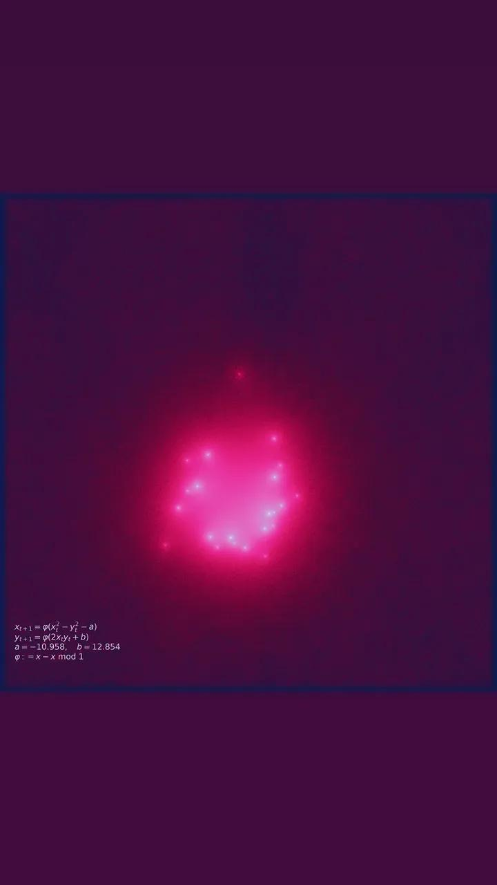
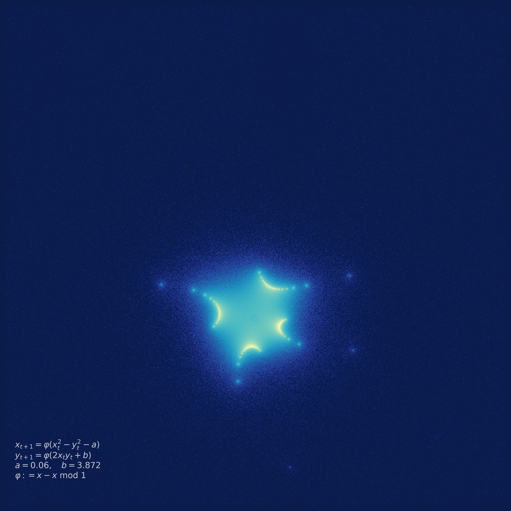

# Attractors

The images in the *Attractors* section are generated by simulating
deterministic, two-dimensional dynamical systems with the presence of
attractors. Typically, the generated points are bounded in some finite subspace
of the plane by using bounded functions (e.g. $\sin x, \cos x, x - \floor{x}$,
etc.) in the system's equations. So far, I have only used periodic bounded
functions, but I will probably be exploring bounded and non-periodic functions
in the future, such as $\sin(x^2)$ or the sigmoid $s(x) = \frac{1}{1 + e^{-x}}$.

### Rosas ardiendo sobre el agua

    

---

### Patronus

    

---

### Family Net

    

---

### Uroboros

    

---

### Life in Search of Matter

    

---

### Soul Council

    

